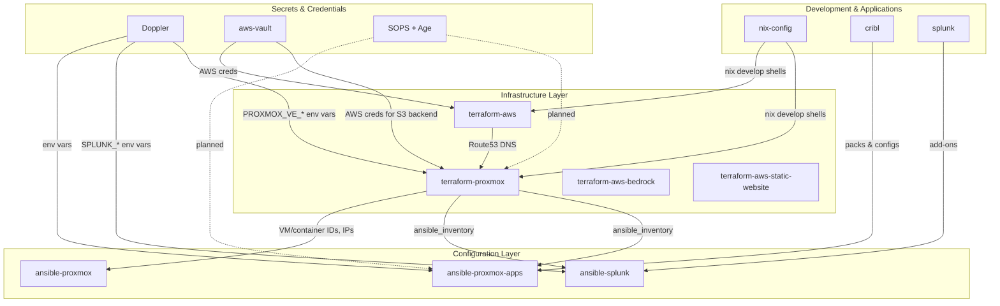
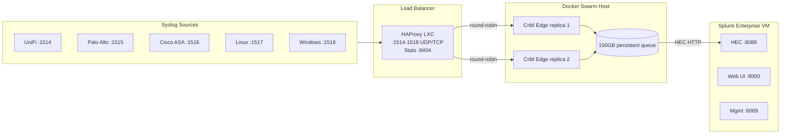
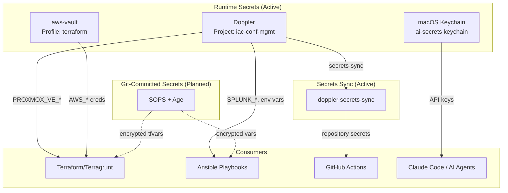

# Infrastructure Architecture

Canonical architecture reference for the Proxmox homelab ecosystem.
All other repositories link here; this is the single source of truth.

## Repository Dependency Graph



## Data Pipeline Flow



## Secrets Chain



## Infrastructure Components

### Proxmox VE Host

Single-node hypervisor running VMs and LXC containers.
Managed by `ansible-proxmox` (kernel, ZFS, monitoring, firewall).

### VMs (terraform-proxmox)

Provisioned via BPG Proxmox Terraform provider. IPs derived from VM ID:
`network_prefix.vm_id` (e.g., VM 200 = `192.168.0.200`).

| Resource | Type | Purpose |
| --- | --- | --- |
| Splunk VM | VM (dedicated module) | Splunk Enterprise in Docker |
| Docker Host | VM | Docker Swarm for Cribl Edge |
| Ansible VM | VM | Ansible control node |

### LXC Containers (terraform-proxmox)

| Resource | Type | Purpose |
| --- | --- | --- |
| HAProxy | LXC | Syslog load balancer |
| Technitium DNS | LXC | Internal DNS |
| apt-cacher-ng | LXC | APT package cache |

### Terraform Modules

| Module | Purpose |
| --- | --- |
| `proxmox-vm` | Generic VM provisioning |
| `proxmox-container` | LXC container provisioning |
| `proxmox-pool` | Resource pool management |
| `splunk-vm` | Splunk-specific VM with Docker |
| `firewall` | Proxmox firewall rules |
| `storage` | Datastore configuration |
| `acme-certificate` | Let's Encrypt via Route53 |
| `security` | Security policies |

### State Management

- **Backend**: S3 + DynamoDB (us-east-2)
- **Encryption**: Enabled at rest
- **Locking**: DynamoDB table per repo
- **Credential**: aws-vault (never stored in files)

## Downstream Inventory Flow

terraform-proxmox produces `ansible_inventory` output consumed by Ansible repos:

```bash
# Regenerate after terragrunt apply
terragrunt output -json ansible_inventory > \
  ~/git/ansible-proxmox-apps/main/inventory/terraform_inventory.json

terragrunt output -json ansible_inventory > \
  ~/git/ansible-splunk/main/inventory/terraform_inventory.json
```

The inventory includes:

- `containers` - LXC containers with `proxmox_pct_remote` connection
- `vms` - VMs with SSH connection
- `docker_vms` - VMs tagged "docker" (subset of vms)
- `splunk_vm` - Dedicated Splunk VM
- `constants` - Pipeline port definitions from `locals.tf`

## Tool Chain

All Terraform commands require the full toolchain wrapper:

```text
nix develop → aws-vault exec → doppler run → terragrunt <command>
```

- **Nix**: Consistent tool versions (Terraform, Terragrunt, Ansible)
- **aws-vault**: AWS credentials for S3 backend
- **Doppler**: Proxmox API credentials (`PROXMOX_VE_*` env vars)
- **Terragrunt**: Wrapper with remote state and provider generation

## Related Documentation

- [LOGGING_PIPELINE.md](./LOGGING_PIPELINE.md) - Detailed syslog pipeline
- [SECRETS_ROADMAP.md](./SECRETS_ROADMAP.md) - Unified secrets strategy
- [INFISICAL_PLANNING.md](./INFISICAL_PLANNING.md) - Self-hosted secrets manager planning
